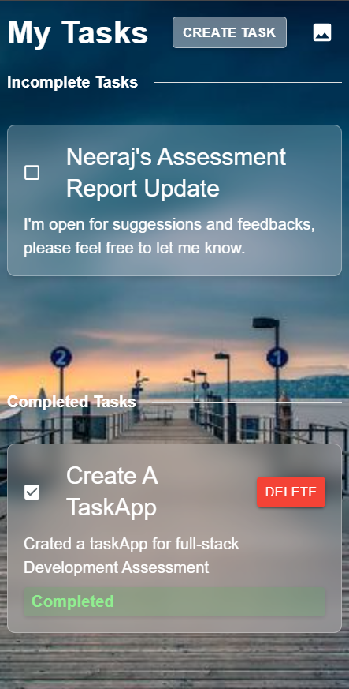

# Simple TaskApp

This project consists of two main parts:
- **Backend**: Node.js/Express server
- **Frontend**: React application

## Prerequisites

Ensure you have the following installed on your system:
- Node.js
- npm (Node Package Manager)

---

## Backend Setup

1. Navigate to the `backend` directory:
    ```bash
    cd backend
    ```

2. Install the dependencies:
    ```bash
    npm install
    ```

3. Start the backend server:
    ```bash
    npm start
    ```

By default, the backend will run on `http://localhost:5000`.

---

## Frontend Setup

1. Navigate to the `frontend` directory:
    ```bash
    cd frontend
    ```

2. Install the dependencies:
    ```bash
    npm install
    ```

3. Start the frontend development server:
    ```bash
    npm start
    ```

By default, the frontend will run on `http://localhost:3000`.

## Screenshot Preview

Here are some preview of the application running:

### Preview 1 (Desktop screen):


### Preview 2 (Mobile Screen):


## Contact

For any questions or suggestions, feel free to reach out:

[Email me](mailto:developneeraj@gmail.com)


---